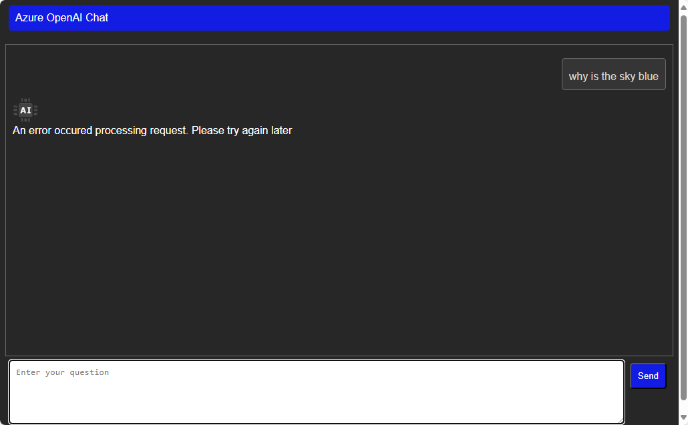
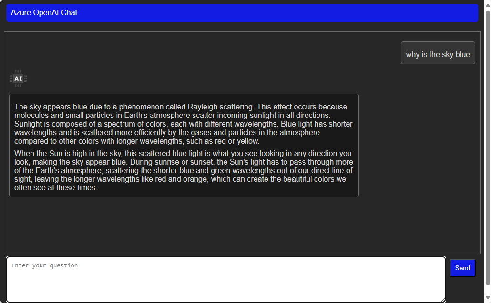

# Challenge-02 - Semantic Kernel Fundamentals

---

[< Previous Challenge](./Challenge-01.md) - **[Home](../README.md)** - [Next Challenge >](./Challenge-03.md)

## Introduction

The first step in understanding Azure OpenAI and Semantic Kernel is to become familiar with the basics. Semantic Kernel is a lightweight, open-source development kit designed to help developers build AI-infused applications using the latest AI models. It supports languages like C#, Python, and Java, making it versatile for various development environments. Semantic Kernel provides a simple and consistent API for developers to interact with several different AI models, including GPT-3.5, GPT-4, Meta-Llama, DALL·E, and many more. You can use Semantic Kernel to build applications that can generate text, images, sound, and even code. Models can be hosted locally or in the cloud, and you can use the same API to interact with them. In this hackathon, you will be using Azure OpenAI models and other Azure services to add intelligence to the provided application.

## Description

In this challenge, you will configure the reference application to use your Azure OpenAI GPT-4o model and finish the implementation of the chat API to respond to user prompts.

## Getting Familiar With the Reference Application

1. From the project root directory navigate to ```.\Resources\src\``` and open the provided application in Visual Studio or Visual Studio Code.

1. Build and run the application. The application should start and display a chat window. In a similar manner to using the Azure AI Studio in the previous challenge, you can interact with the chat window by typing a question or prompt and pressing the **Enter** key. Currently, the application will respond with an error message because the AI Model has not been configured. 

    

1. Open the ```Program.cs``` file

    At the heart of the Semantic Kernel framework is the **Kernel** object. Here is where you register the AI Models you will be working with and any Plugins you be using in your application. You will learn about Plugins in later challenges. The **Kernel** object is also where you can configure the AI Models you will be using.

    Starting on line 45, the Kernel object is being configured to use an Azure OpenAI chat model by calling the ```AddAzureOpenAIChatCompletion``` method of the Kernel Builder class.  

    ```csharp
    //Configure Semantic Kernel
    var kernelBuilder = Kernel.CreateBuilder();

    //Add Azure OpenAI Chat Completion
    kernelBuilder.AddAzureOpenAIChatCompletion(
        config["AOI_DEPLOYMODEL"],
        config["AOI_ENDPOINT"]!,
        config["AOI_API_KEY"]!);
    ```

    The **AddAzureOpenAIChatCompletion** method takes three parameters: the deployment model name, the endpoint URL, and the API key. These values are read from the *appsettings.json* file. Next, some additional services are added and logging is configured. Finally, the **Kernel** object is built and the application is started.

    Starting on line 72 begins the API endpoint definitions with the most important being the ```/chat``` endpoint. This is where the Chat History including the users prompt is received by the client application and sent to the AI model for processing. The AI response is then sent back to the user. The Kernel object we just created is passed to the handler so that it can be used to interact with the AI model. In the remaining tasks in this challenge you will complete the implementation of the ```/chat``` endpoint.

    ```csharp
    app.MapPost("/chat", async (
        HttpContext context,
        [FromBody] ChatRequest chatRequest,
        [FromServices] Kernel kernel) => {
    ```

## Challenges

1. Deploy a ***Standard*** GTP-4o model using  [Azure AI Studio](https://oai.azure.com) `https://oai.azure.com`. The **Deployment name** should be something similar to ```gtp-4o```, this name will be needed later when configuring Semantic Kernel.

1. Update the *appsettings.json* file with the Azure OpenAI *Deployment name*, *Endpoint URL* and the *API Key*. These values can be found in the Azure OpenAI Studio.

    **appsettings.json**

    ```json
    "AOI_DEPLOYMODEL": "Replace with your AOI deployment name",
    "AOI_ENDPOINT": "Replace with your AOI endpoint",
    "AOI_API_KEY": "Replace with your AOI API key",
    ```

1. Add the **users message** to the chat history collection.

    In the `Program.cs` file, find the handler for the `/chat` POST request. Below the comment `//Challenge 2: add current prompt to chatHistory`, add the user's prompt from the `ChatRequest` object to the chat history collection.

    ```csharp
    app.MapPost("/chat", async (
    HttpContext context,
    [FromBody] ChatRequest chatRequest,
    [FromServices] Kernel kernel) => {

    //removed for brevity

    //Convert chat history from client to Semantic Kernel ChatHistory collection
    var chatHistory = ExtractHistory(chatRequest);
    
    //Challenge 2: add current prompt to chatHistory
    ```

    :bulb:For a detailed explanation of Chat History, please refer to the documentation [here](https://learn.microsoft.com/en-us/semantic-kernel/concepts/ai-services/chat-completion/chat-history?pivots=programming-language-csharp).

1. Retrieving chat completion services

    The Chat Completion service has already been configured and added to the **Kernel** object.

    After the comment ```//Challenge 2: Get the chat completion service from Semantic Kernel```, add code to retrieve the chat completion service from Semantic Kernel.

    :bulb:Review the documentation for chat completion [here](https://learn.microsoft.com/en-us/semantic-kernel/concepts/ai-services/chat-completion/?tabs=csharp-AzureOpenAI%2Cpython-AzureOpenAI%2Cjava-AzureOpenAI&pivots=programming-language-csharp)

1. Complete the implementation of the chat API endpoint by sending the entire chat history, including the latest prompt, to the Azure OpenAI chat service. Once the service processes this and generates a response, wait until the full response is received before sending it back to the client.

    :bulb:Refer to the Semantic Kernel documentation [here](https://learn.microsoft.com/en-us/semantic-kernel/concepts/ai-services/chat-completion/?tabs=csharp-AzureOpenAI%2Cpython-AzureOpenAI%2Cjava-AzureOpenAI&pivots=programming-language-csharp#using-chat-completion-services) for an example of how to call the chat completion service.

1. Run the application and test the chat completion by submitting the prompt ```Why is the sky blue```. The response should be similar to the following

    

    :bulb:For more information on the Semantic Kernel, refer to the documentation [here](https://learn.microsoft.com/en-us/semantic-kernel/concepts/kernel?pivots=programming-language-csharp).

1. Test the Chat History by submitting the following prompt without refreshing the browsing window and clearing the chat history.

    ```Why is it red```

    If the chat history is working, the AI will understand the context of the question to be ```Why is the sky red``` and provide a relevant response.

    :bulb:For more information on Chat History, refer to the documentation [here](https://learn.microsoft.com/en-us/semantic-kernel/concepts/ai-services/chat-completion/chat-history?pivots=programming-language-csharp).

1. Test the application with different prompts to ensure that it can respond to a variety of questions.


## Success Criteria

1. Verify that you deployed a Standard GPT-4o
1. Updated *appsettins.json* file with the correct values for Azure OpenAI GPT-4o model.
1. The application runs and responds to users questions
1. The chat history is working as expected

## Learning Resources

[Understanding the kernel](https://learn.microsoft.com/en-us/semantic-kernel/concepts/kernel?pivots=programming-language-csharp)

[Chat completion](https://learn.microsoft.com/en-us/semantic-kernel/concepts/ai-services/chat-completion/?tabs=csharp-AzureOpenAI%2Cpython-AzureOpenAI%2Cjava-AzureOpenAI&pivots=programming-language-csharp)

[Chat history](https://learn.microsoft.com/en-us/semantic-kernel/concepts/ai-services/chat-completion/chat-history?pivots=programming-language-csharp)

[What is a Planner?](https://learn.microsoft.com/en-us/semantic-kernel/concepts/planning?pivots=programming-language-csharp)
