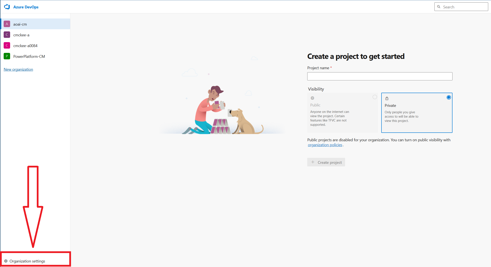
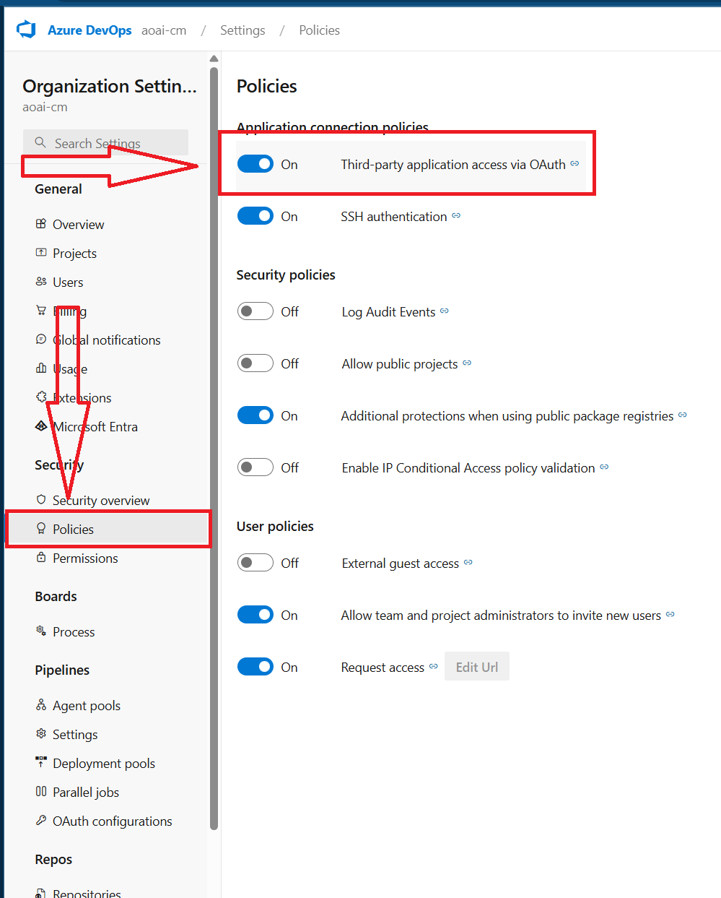
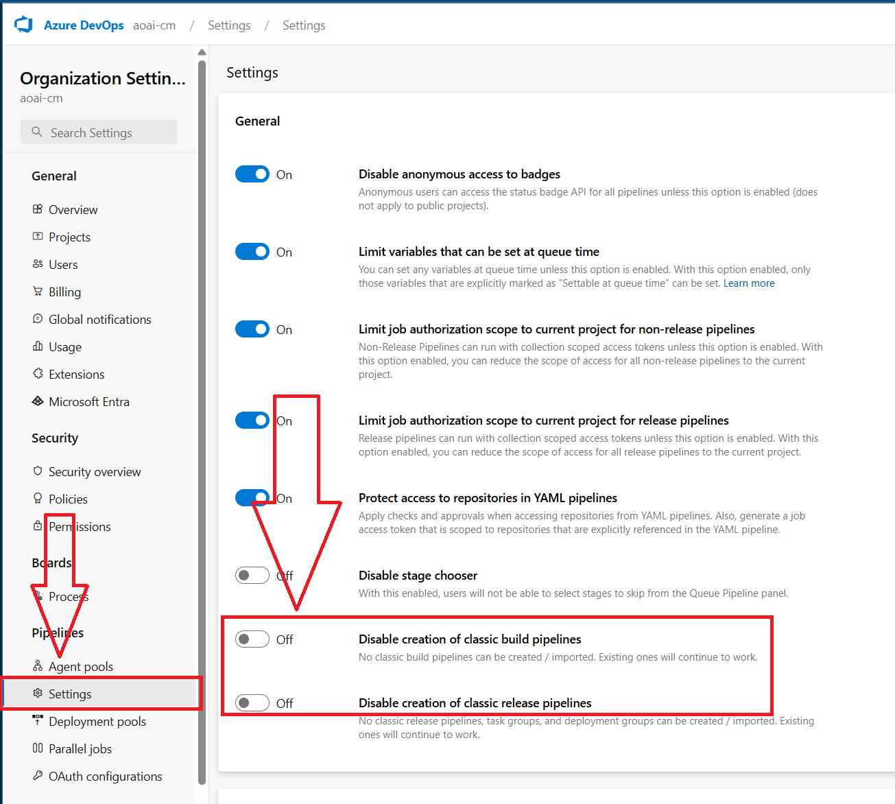
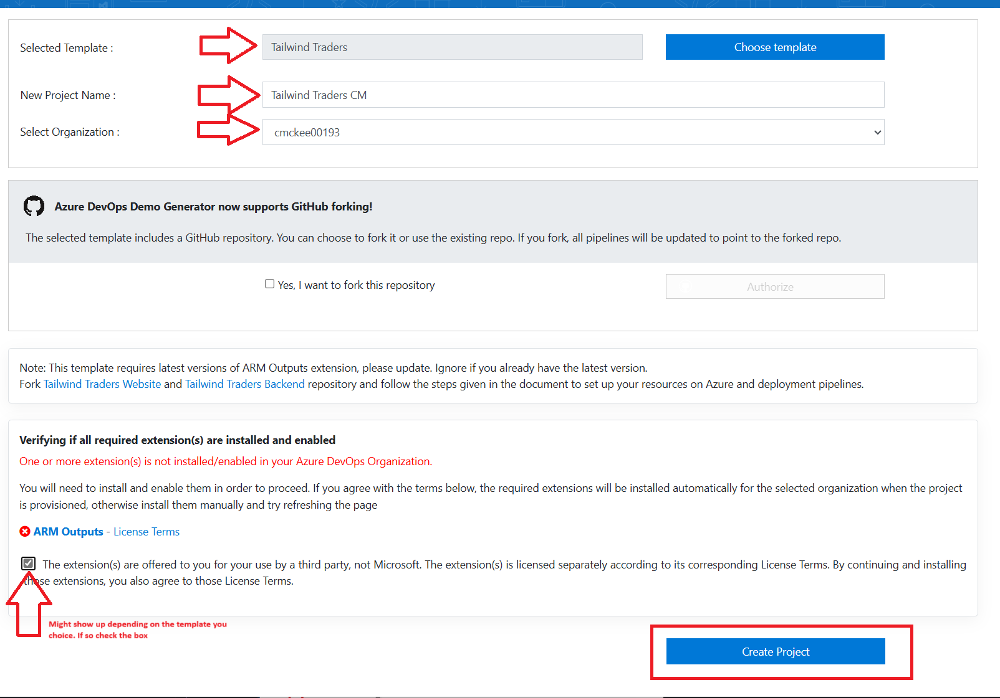

[< Back to Challenge](./Challenge-04.md) - **[Home ](../README.md)** [>]()  

# Challenge 04 Pre-requisites - Setup of Azure DevOps

## Create Azure DevOps Organization and Project

### Azure Portal

1. Open the Azure Portal and search for `Azure DevOps` in the search bar.
1. Click on `Azure DevOps organizations` and then click on `Create organization`.
1. Click on `My Azure DevOps Organizations` then click on `Create new organization`.
1. Fill in the required fields and click on `Continue`.\
1. Click on `Organization settings`.

    

1. Under `Policies` turn on `Third-party application access via OAuth`.

    

1. Under Pipelines turn off `Disable creation of classic build pipelines` and `Disable creation of classic release pipelines`.

    

### Azure DevOps Demo Generator

1. Navigate to [Azure DevOps Demo Generator](https://azuredevopsdemogenerator.azurewebsites.net/) and click on `Sign in`.
1. Choose `Tailwind Traders`.
1. Give it a name and select the organization you created.
1. Check the box, click on `Create Project`.

    

1. Once this is done, click on `Navigate to project`.

## Success Criteria

1. Verify that you can navigate to the the new project in Azure DevOps.
1. Verify that the project has mock work items, repos, pipelines, and boards.

Back to [Challenge 04](./Challenge-04.md) - **[Home](../README.md)**
