[< Back to Challenge](./Challenge-04.md) - **[Home ](./README.md)** [>]()

# Challenge 04 Pre-requisites - Setup Azure Logic Apps

## Create Azure Logic App

### Logic App

1. Open the Azure Portal and search for `Logic App` in the search bar.
1. Click on `Logic Apps` and Add a new Logic App.
1. Under the  `Standard` section select `Workflow Service Plan` and click on `Select`.
1. Place it in the same resource group as Azure Open AI resource.
1. Create a new Windows Plan.
1. Pick a location and click on `Review + Create` then `Create`.
1. Once the Logic App is created, click on `Go to resource`.

### Enable Access to Logic App

1. Modify Logic App Host.json file.
2. Create App Registration for the Logic App.
3. Turn on EasyAuth by assigning the App Registration to the Logic App.
4. Add code to program.cs to login and acquire a token for Logic Apps.

#### Modify Logic App Host.json file

1. In the Logic App under development tools, click on `Advanced Tools` then `Go`.

    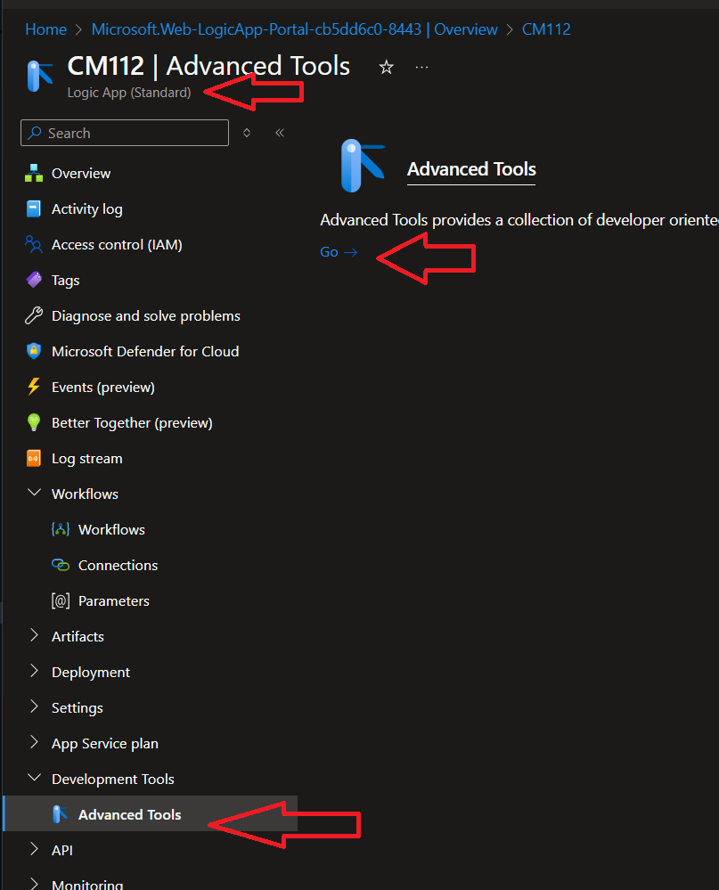

1. Click on `Debug Console` then `CMD`.
1. Navigate to `site/wwwroot` and edit the file called `host.json`.

    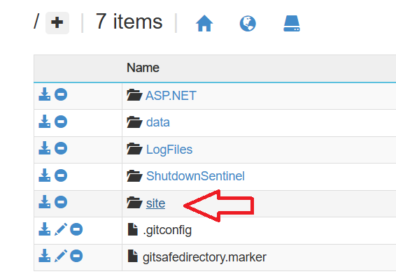

1. Click the edit icon for the host.json file.

    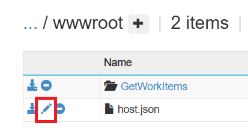

1. Replace all the code in the file with the code below and click on `Save`.

    ```json
    {
        "version": "2.0",
        "extensionBundle": {
            "id": "Microsoft.Azure.Functions.ExtensionBundle.Workflows",
            "version": "[1.*, 2.0.0)"
        },
        "extensions": {
            "http": {
                "routePrefix": ""
            },
            "workflow": {
                "MetadataEndpoints": {
                    "plugin": {
                        "enable": true,
                        "Authentication": {
                            "Type": "Anonymous"
                        }
                    },
                    "openapi": {
                        "enable": true,
                        "Authentication": {
                            "Type": "Anonymous"
                        }
                    }
                },
                "Settings": {
                    "Runtime.Triggers.RequestTriggerDefaultApiVersion": "2020-05-01-preview"
                }
            }
        }
    }
    ```

#### Create App Registration for the Logic App

1. Navigate to the Azure Portal and search for `App Registrations` in the search bar.
1. Click on `New registration` and give it a name like `LogicAppAuth`, then click on `Register`.
1. Under Authentication click on `Add a platform` then click on `Mobile and desktop applications`. Then add a redirect URI of your app, it should be `http://localhost:5280`.
1. Under Expose an API click on `Add a scope`, then click `Save and Continue`.
1. Give it a name like `SKLogicApp`, check `Admins and users`, fill in the remaining fields and click on `Add scope`.
1. The scope will be used in the Semantic Kernel app to access the Logic App.
1. Capture the `Application (client) ID` and `Directory (tenant) ID` from the App Registration Overview section. Then add it to the secrets manager in the Semantic Kernel app or appsettings.json file.
    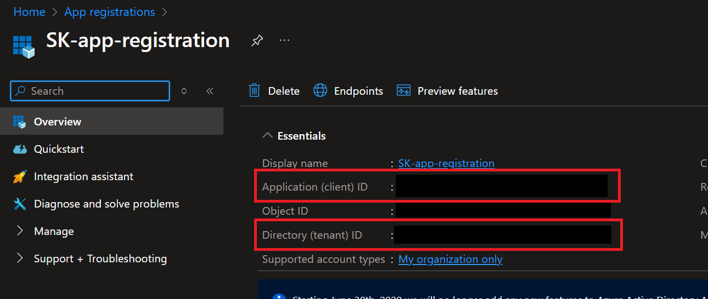
1. Capture the `Scope` from the App Registration found under the `Expose an API` section. Then add it to the secrets manager in the Semantic Kernel app or appsettings.json file.
    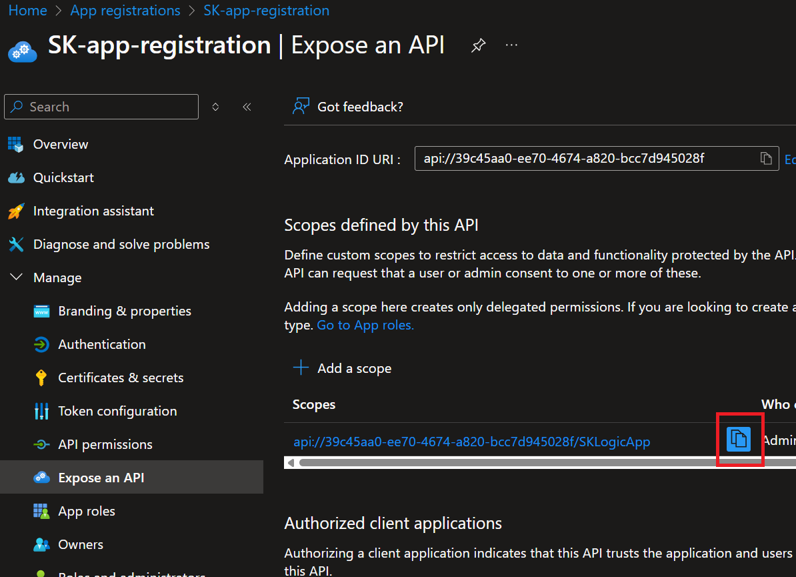


#### Turn on EasyAuth by assigning the App Registration to the Logic App

1. Navigate back to the Logic App in the Azure Portal.
1. Under `Settings` click on `Authentication` then click on `Add identity provider`.
1. Select `Microsoft` and click on `Add`.
1. Using the information from the App Registration, fill in the following fields:
    - `Client ID`
    - `Issuer URL`
        - Copy this `https://sts.windows.net/{yourtenantid}` and replace `{yourtenantid}` with your tenant id.
    - `Allowed token audiences` 
        - Copy this `api://{yourclientid}` and replace `{yourclientid}` with your client id.
1. Next the 3 selections will be as follows:
    - `Allow requests only from this application itself`
    - `Allow requests from any identity`
    - `Use default restrictions based on issuer`
1. Click on `Save`.

#### Add code to Program.cs to login and acquire a token for Logic Apps

1. In the Semantic Kernel app, navigate to the `Program.cs` file.
1. Register your Tenant ID, Client ID, and Scope in secrets manager.
1. You will find this code commented out in the Program.cs file. Uncomment it and ensure you have the correct values in the secrets manager or appsettings.json file.

    ```csharp
    string ClientId = config["LOGIC_APP_CLIENT_ID"]!;
    string TenantId = config["TENANT_ID"]!;
    string Scope = config["LOGIC_APP_SCOPE"]!;
    string Authority = $"https://login.microsoftonline.com/{TenantId}";
    string[] Scopes = { Scope };

    var publicClient = PublicClientApplicationBuilder.Create(ClientId)
                .WithAuthority(Authority)
                .WithDefaultRedirectUri() // Uses http://localhost for a console app
                .Build();

    AuthenticationResult authResult = null;
    try
    {
        authResult = await publicClient.AcquireTokenInteractive(Scopes).ExecuteAsync();
    }
    catch (MsalException ex)
    {
        Console.WriteLine("An error occurred acquiring the token: " + ex.Message);
    }
    ```

### Logic App Workflow

1. Navigate back to the Logic App in the Azure Portal.
1. Under `Workflow` click on `Workflows` then click on `Add`.
1. Give it a name like `GetWorkItems` and click on `Stateless` then `Create`.
1. In the Overview tab turn on `Enable Debug Mode`.

    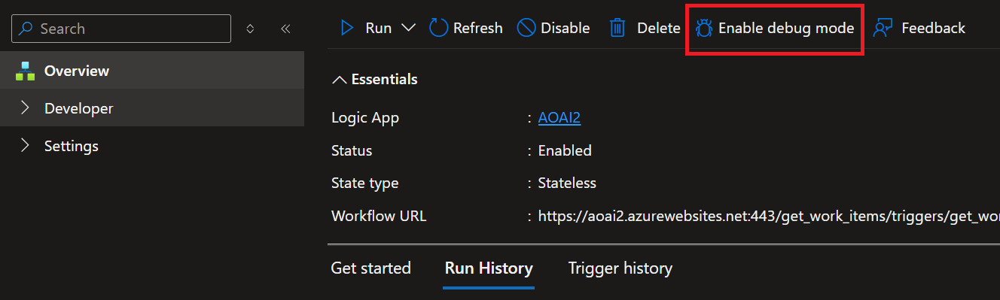

1. Expand Developer, Click on `Designer` then click on `Add a trigger`.

    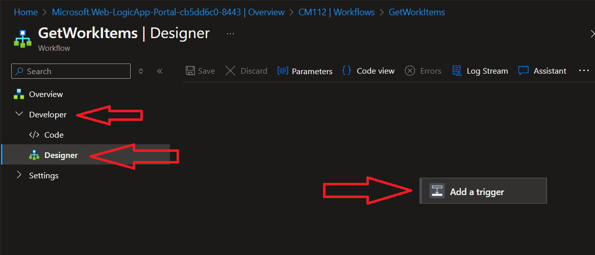

1. Search for `Request` and click on `When an HTTP request is received`.
1. Change the Verb to Post.

    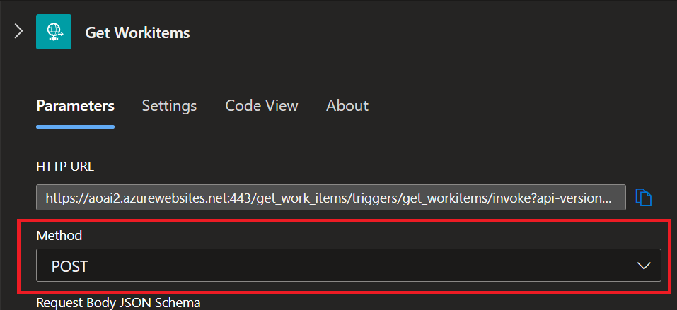

1. Next click on `Add an action` and search for `Azure DevOps` then click on `Get query results`. In the future you can swap this out for a different action. Right now we are getting you to a working Logic App.

    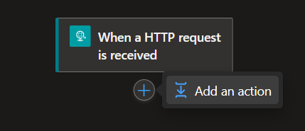

1. Click on `Sign in`, if you have a popup blocker you might have to allow popups.

    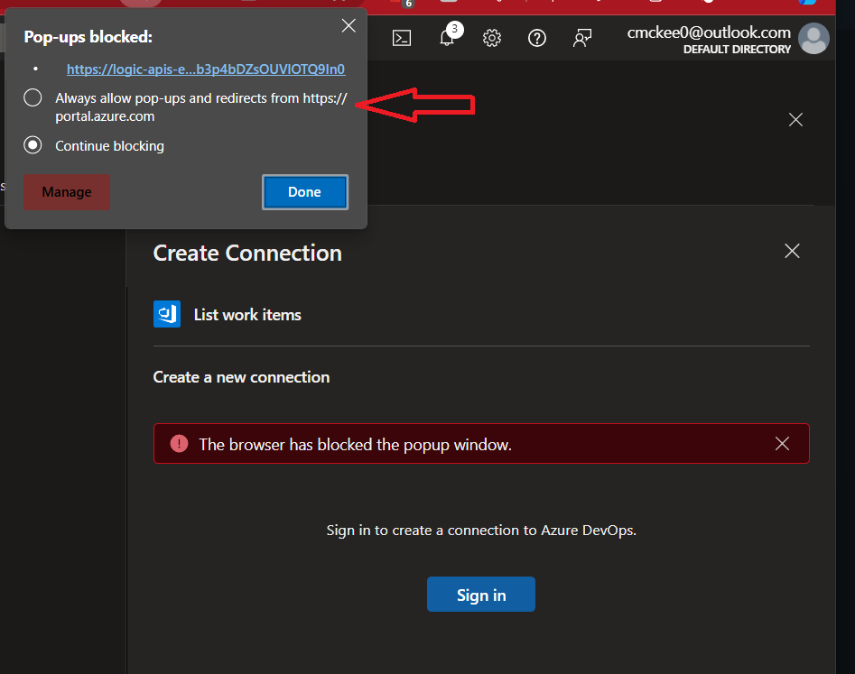

1. Select the organization and project you created earlier and then navigate to the `Assigned to me` query as seen below. Or use any query you like that is available in the Azure DevOps project.

    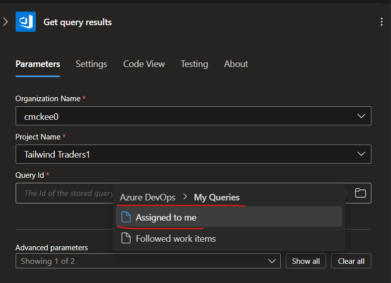

1. Click on `Add an action` and search for `Request` then click on `Response`.

    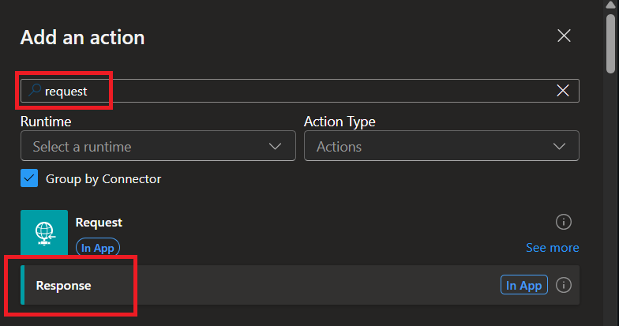

1. In the body text field we will use dynamic content to add the `Body` from the `Get query results` action to the `Body` of the `Response` action.

    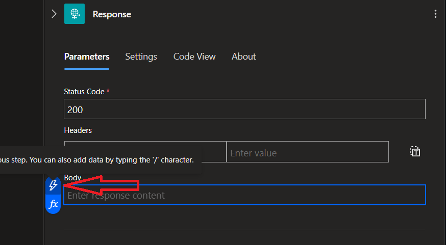

1. Save your Logic App. Now a url will be generated on the `When an HTTP request is received` trigger. Copy this url. Paste it in a browser or HTTP client like Postman to test the Logic App.

    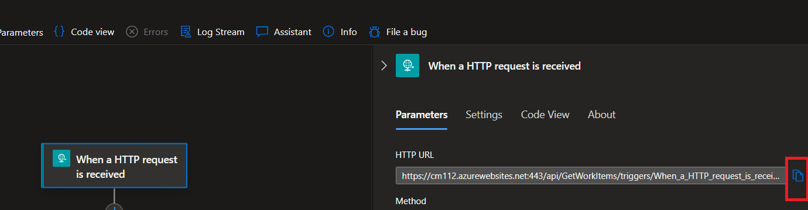

1. Lastly, you will need the swagger URI for the challenge. Using the URL you copied from the last step, replace everything after `.com/` with `swagger.json`. This will give you the swagger URI for the Logic App. Here is an example:

    ```csharp
    // Before
    "https://aoai2.azurewebsites.net:443/get_work_items/triggers/get_workitems/invoke?api-version=2022-05-01&sp=Sample%2Frun&sv=1.0&sig=samplesignature"

    // After
    "https://aoai2.azurewebsites.net:443/swagger.json"
    ```

## Success Criteria

1. Successfully create a new Logic App in the Azure Portal.
1. Successfully call the Logic App from a browser or HTTP client like Postman.

Back to [Challenge 04](./Challenge-04.md) - **[Home](../README.md)**

[< Back to Challenge](./Challenge-04.md) - **[Home ](./README.md)** [>]()
