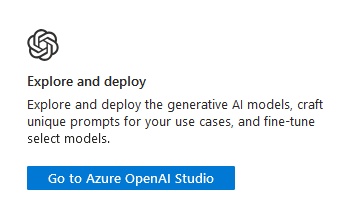
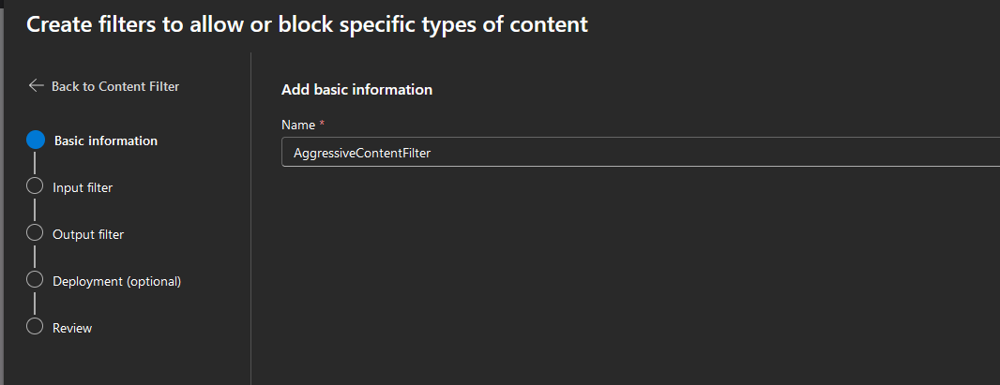
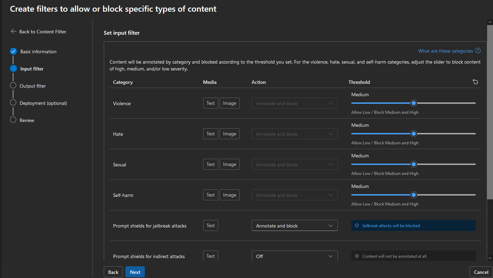
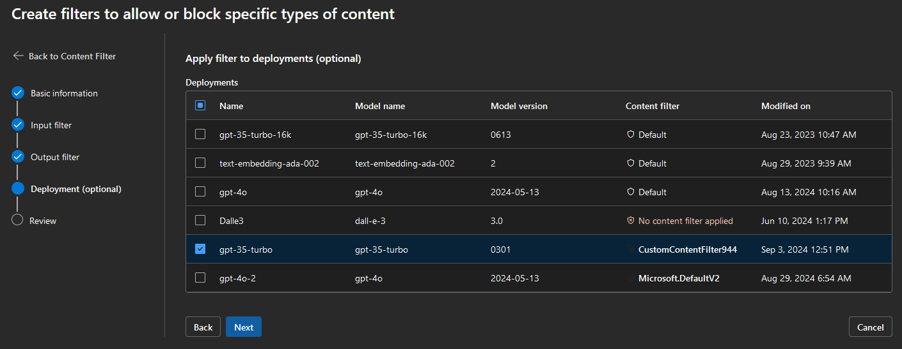
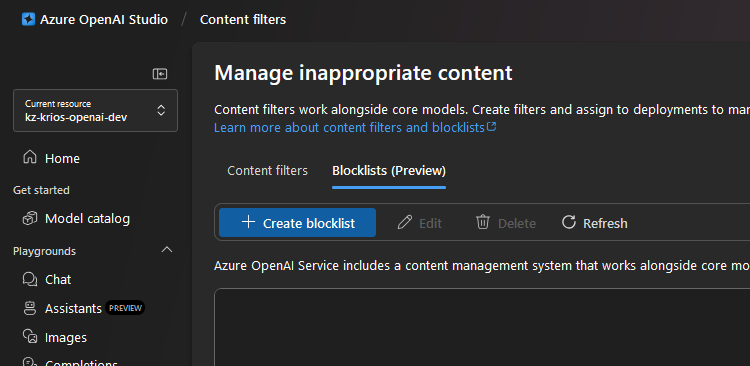
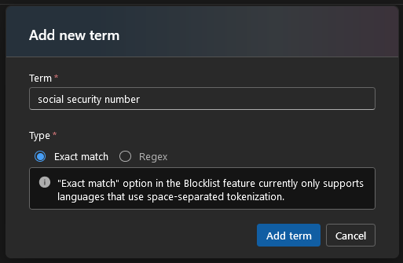

### [< Previous Challenge](./Challenge-05.md) - **[Home](./README.md)** - [Next Challenge >](./Challenge-07.md)

# Challenge 06 - Responsible AI: Exploring Content Filters in Azure OpenAI

## Introduction

In this challenge, you will learn how to enhance the safety and reliability of your AI-powered applications by leveraging content filters and protection mechanisms available in Azure OpenAI. Azure AI provides powerful tools to help developers create ethical AI solutions by filtering out harmful or inappropriate content from model outputs. You will explore how to work with these filters in the Azure OpenAI Studio, adjust settings, and even create custom filters to block specific words or phrases.

Content filters are essential in ensuring that your AI models meet your organization's ethical guidelines and regulatory requirements. By the end of this challenge, you will be able to configure filters that align with your application's needs and ensure safer interactions.

## Pre-requisites

1. [Access to Azure OpenAI Studio](https://learn.microsoft.com/en-us/azure/cognitive-services/openai/how-to/access-studio) (See step 1 below).
2. An Azure OpenAI resource created in an earlier challenge.

> NOTE: Make sure you have access to the Azure OpenAI Studio and an existing Azure OpenAI resource, as these are required to complete this challenge.

## Challenges

This challenge will guide you through configuring and testing content filters using Azure OpenAI Studio.

### Navigate to Azure OpenAI Studio

- **Azure Portal**
  - Navigate to your already-created Open AI resource in the Azure Portal.
  - At the bottom of the overview page, click the button for "Go to Azure OpenAI Studio".

    

- **Direct link:** https://oai.azure.com/


### Adjust Filter Settings

1. Navigate to the "**Content Filters**" tab at the lower left.
1. Click "**Create content filter**", then enter a name for your new filter.

    

1. Experiment with the threshold sliders for filtering out offensive language or specific categories of content.

    

    - The first screen of sliders controls the "**input filter**", meaning the content a user enters into the prompt.
    - The subsequent screen of sliders controls the "**output filter**", which is applied to content returned from the LLM.
1. On the final page, you will be presented with a list of existing model deployments that your content policy can be applied to. Select the row that matches the model in your program's app configuration, then click next. If prompted, click "Replace" to replace the existing default content filtering policy.

    

1. **Test the changes** by running prompts through the model and observing the impact of the filters.

### Filter specific words or patterns

:bulb: **Blocklists** can be used to create a custom filter to block a specific word or phrase that you believe should be filtered in your application.

1. Return to the **Content filters** tab, then on the resulting screen, click the Blocklists (Preview) tab.

    

1. Click **Create blocklist**, then enter a name & description *(optional)*.
1. After you are returned to the list, click the newly created blocklist to access the term list.

    

    - Proceed to add a term you would like to be excluded. You could use a random test word like "unicorn", or something more realistic—like "social security number."
    - It also supports using regex to generically filter input that matches a predefined pattern.

### Integrating Filters into Your Workflow

- Consider how these filters could be integrated into your broader AI application or workflow.
- Think about scenarios where custom filters might be essential for maintaining ethical standards. Keep these in mind when developing with AI solutions in the future.

## Success Criteria

1. You have successfully navigated the Azure OpenAI Studio and adjusted the default content filter settings.
2. You experimented and observed the results of different filter settings.
3. You created and tested a custom blocklist to filter specific terms, phrases, or patterns.

## Learning Resources

- [How to configure content filters with Azure OpenAI Service](https://learn.microsoft.com/en-us/azure/ai-services/openai/how-to/content-filters) - Detailed steps for configuring filtering in AOAI
- [Use a blocklist in Azure OpenAI](https://learn.microsoft.com/en-us/azure/ai-services/openai/how-to/use-blocklists) - Help with explicitly filterering additional predefined terms, are specific to one's use case
- [Data, privacy, and security for Azure OpenAI Service#Preventing abuse & harmful content generation](https://learn.microsoft.com/en-us/legal/cognitive-services/openai/data-privacy?tabs=azure-portal#preventing-abuse-and-harmful-content-generation) - General outline of content safety & abuse monitoring functionality 
- [Using Filters in Semantic Kernel](https://devblogs.microsoft.com/semantic-kernel/filters-in-semantic-kernel) - Semantic Kernel itself has filtering capability. While it isn't explicitly covered in this workshop, you can find a summary and example below.

## Bonus: Semantic Kernel Filters (in code)

Semantic Kernel itself supports custom filters for requests in the pipeline by creating implementations of `IPromptRenderFilter`, `IFunctionInvocationFilter`, etc. Currently it is not supported for the method that we use for chat completion, but is supported by Semantic Kernel's *Invoke* methods, like `Kernal.Invoke()` and `KernelFunction.Invoke()`.

By using these, one can intercept a prompt before and/or after it is rendered. Implementing this filtering technique is not explicitly covered in this workshop, though, as we chose to use (`ChatCompletionService.GetChatMessageContentsAsync())` for our chat completion for its ability to easily support a chat history with completion. 

With that said, here's a brief example of a simple prompt filter created in code. 

1. Create a implementation of IPromptRenderFilter

    ```csharp
    public class FilterExample(ILogger<FilterExample> logger) : IPromptRenderFilter
    {
        public async Task OnPromptRenderAsync(PromptRenderContext context, Func<PromptRenderContext, Task> next)
        {
            logger.LogDebug($"Prompt: {context.RenderedPrompt}");

            await next(context);

            if (context.RenderedPrompt.Contains("social security number"))
            {
                context.RenderedPrompt = "The prompt contains sensitive content.";
                context.Result = new FunctionResult(context.Function, "The prompt contains sensitive content."); //When context.result is populated, function execution is skipped and the result returned
            }
            logger.LogDebug($"Rendered Prompt: {context.RenderedPrompt}");
        }
    }
    ```

2.  Register it when building the kernel.

    ```csharp
    // Configure Semantic Kernel
    var kernelBuilder = Kernel.CreateBuilder();
    kernelBuilder.AddAzureOpenAIChatCompletion("...");
    // Inject filter
    kernelBuilder.Services.AddSingleton<IPromptRenderFilter, FilterExample>();
    ```

3. Whenever a prompt is invoked via a supported Invoke method, the filter code will be ran before the prompt is processed. When the condition matches, we override the value Context.Result, resulting in the new sensitive content message being returned to the user.

### [< Previous Challenge](./Challenge-05.md) - **[Home](./README.md)** - [Next Challenge >](./Challenge-07.md)
